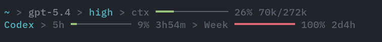
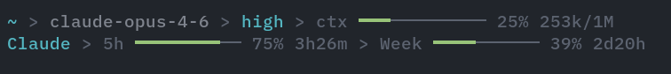

# pi-minimal-footer

Minimal footer for [pi](https://github.com/badlogic/pi-mono) that replaces the default footer with a compact two-line display: context gauge on top, subscription usage bars below.





## Features

- **Context gauge** — working directory, git branch, model, thinking level, and context window usage with token counts
- **Subscription usage bars** — rolling window quotas with reset timers for supported providers
- **Auto-refresh** — fetches usage on startup and model switch, then every 5 minutes
- **Git integration** — branch name, dirty state, ahead/behind counts (supports jj)

## Supported providers

| Provider | What it shows |
|----------|---------------|
| Claude Max | 5h + weekly rolling windows |
| OpenAI Codex | Primary + secondary rolling windows |
| GitHub Copilot | Premium interactions + chat quotas |
| Google Gemini | Pro + Flash remaining quotas |
| MiniMax | 5h + weekly rolling windows (Token Plan / Coding Plan) |
| MiniMax CN | Same as MiniMax, China endpoint |

## Install

```bash
pi install npm:@ogulcancelik/pi-minimal-footer
```

## How it works

The footer reads context usage from the last assistant message's token counts (free — comes with every LLM response). Subscription usage is fetched from each provider's dedicated quota API using your existing auth tokens from `~/.pi/agent/auth.json` or environment variables.

Usage is fetched:
- Once on startup
- Immediately on model switch (Ctrl+P)
- Every 5 minutes after that

The footer adapts to narrow terminals by stacking lines vertically instead of the single-line wide layout.

## Notes

- Replaces the default pi footer entirely via `ctx.ui.setFooter()`
- Auth tokens are read from `~/.pi/agent/auth.json` (populated by `/login`) or standard env vars (`ANTHROPIC_API_KEY`, `MINIMAX_API_KEY`, etc.)
- Providers without auth simply don't show a usage bar — no errors
